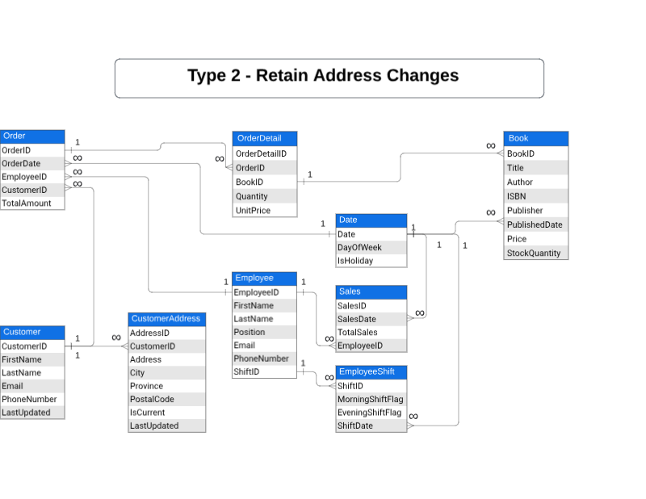

# Assignment 1: Design a Logical Model

## Question 1
Create a logical model for a small bookstore. 📚

At the minimum it should have employee, order, sales, customer, and book entities (tables). Determine sensible column and table design based on what you know about these concepts. Keep it simple, but work out sensible relationships to keep tables reasonably sized. Include a date table. There are several tools online you can use, I'd recommend [_Draw.io_](https://www.drawio.com/) or [_LucidChart_](https://www.lucidchart.com/pages/).

```
Benjamin Su's answer here:

ERD - Type 1


```
## Question 2
We want to create employee shifts, splitting up the day into morning and evening. Add this to the ERD.
```
Answer here:

Please refer to "ERD - Type 1" answered in Question 1

```

## Question 3
The store wants to keep customer addresses. Propose two architectures for the CUSTOMER_ADDRESS table, one that will retain changes, and another that will overwrite. Which is type 1, which is type 2?

_Hint, search type 1 vs type 2 slowly changing dimensions._

```
Answer here:

ERD - Type 1 - Overwrite address changes
Please refer to the diagram above in Question 1

ERD - Type 2 - Retain address changes


```

Bonus: Are there privacy implications to this, why or why not?
```
Answer here:

Use a new “Customer Address” table for tracking customer addresses and changes involves handling Personally Identifiable Information (PII), which requires privacy protection and compliance with regulations such as the General Data Protection Regulation (GDPR) and other relevant regulations, and also facilitate encrypting sensitive data, implementing strict access controls, and maintaining audit trails, etc.

```

## Question 4
Review the AdventureWorks Schema [here](https://i.stack.imgur.com/LMu4W.gif)

Highlight at least two differences between it and your ERD. Would you change anything in yours?
```
The provided AdventureWorks schema is a more complex and comprehensive database schema compared to the simplified bookstore database schema I designed. Many differences between the architectures and here are some key aspects:

-	AdventureWorks Schema is designed for a much larger and more complex system, which includes comprehensive tables for various business processes such as SalesOrder, PurchaseOrder, ProductInventory, EmployeeDepartmentHistory, etc., covering many aspects of business operations.
The bookstore schema is much simpler, focusing on basic functionalities like managing employees, customers, books, orders, and sales, tailored for a small bookstore's needs.

-	AdventureWorks Schema has more address management centralized under the Person schema, and it includes additional entities such as AddressType and StateProvince which allows for detailed management of address information.
The bookstore just overwrites the address in the Type 1 architecture which is not a good fit for large retail system design and implementation, even with the enhancement to retain historical changes in a separate CustomerAddress table in Type 2 architecture which is still not good enough for a large scale system/project.

What I learned from above is to design for a large enterprise level system with extensive and detailed data requirements, using a highly modular and normalized approach across multiple schemas. It includes detailed management of entities such as addresses, products, orders, and human resources, with comprehensive relationships and reference tables, which can support a broad range of business processes and detailed data tracking.

```

# Criteria

[Assignment Rubric](./assignment_rubric.md)

# Submission Information

🚨 **Please review our [Assignment Submission Guide](https://github.com/UofT-DSI/onboarding/blob/main/onboarding_documents/submissions.md)** 🚨 for detailed instructions on how to format, branch, and submit your work. Following these guidelines is crucial for your submissions to be evaluated correctly.

### Submission Parameters:
* Submission Due Date: `June 1, 2024`
* The branch name for your repo should be: `model-design`
* What to submit for this assignment:
    * This markdown (design_a_logical_model.md) should be populated.
    * Two Entity-Relationship Diagrams (preferably in a pdf, jpeg, png format).
* What the pull request link should look like for this assignment: `https://github.com/<your_github_username>/sql/pull/<pr_id>`
    * Open a private window in your browser. Copy and paste the link to your pull request into the address bar. Make sure you can see your pull request properly. This helps the technical facilitator and learning support staff review your submission easily.

Checklist:
- [ ] Create a branch called `model-design`.
- [ ] Ensure that the repository is public.
- [ ] Review [the PR description guidelines](https://github.com/UofT-DSI/onboarding/blob/main/onboarding_documents/submissions.md#guidelines-for-pull-request-descriptions) and adhere to them.
- [ ] Verify that the link is accessible in a private browser window.

If you encounter any difficulties or have questions, please don't hesitate to reach out to our team via our Slack at `#cohort-3-help`. Our Technical Facilitators and Learning Support staff are here to help you navigate any challenges.
